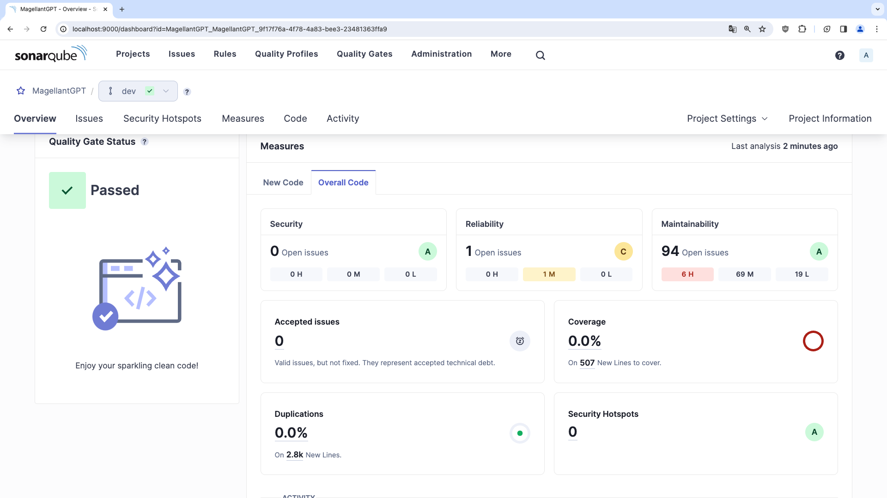

# Analyse de la qualité du code avec SonarQube Community

SonarQube est une plateforme incontournable pour l'analyse de code, indispensable pour maintenir une qualité de code élevée dans les projets de développement logiciel. En identifiant automatiquement les bugs, les vulnérabilités de sécurité, et les mauvaises pratiques, SonarQube facilite grandement le travail des développeurs. Il offre une vue d'ensemble claire des points à améliorer, permettant une correction efficace et rapide.

Compatible avec de nombreux langages de programmation, SonarQube s'intègre parfaitement dans les workflows CI/CD, renforçant les processus d'intégration et de déploiement continu. Grâce à son interface utilisateur intuitive, il rend l'analyse de code accessible à tous, contribuant à une amélioration continue de la qualité du code et à la sécurité des applications.

## Prérecquis

- Docker Desktop

## Installation et déploiement SonarQube avec Docker

```bash
docker run -d --name sonarqube -p 9000:9000 -p 9092:9092 sonarqube:lts-community
```

## Configuration Sonar

Une fois le conteneur déployé, vous pouvez accéder à une instance de SonarQube en suivant http://localhost:9000

Les identifiants par défaut sont :  
Login : admin  
Pwd : admin

### Importer le dépôt de votre code source

Vous pouver importer un dépôt Azure Devops, pour cela :

1. Saisir l'url de votre Devops
2. Saisir un Personnal Access Token que vous générer avec les droits d'accès Read&Write sur le Code
3. Sélectionner et importer votre dépôt
4. Utiliser les paramètres par défaut
5. Sélectionner la façon avec laquelle vous souhaitez utiliser pour l'exemple locallement

## Analyse du projet

Suivez les étapes

1. Générer un token SonarQube
2. Sélectionner le langage
3. Installer la version de sonar scanner sur votre PC

```bash
dotnet tool install --global dotnet-sonarscanner
```

4. Exécuter le scan du projet

Utiliser les commandes précisées dans SonarQube à la racine de votre projet, puis vouspouvez accéder au rapport d'analyse


Vous pouvez accéder à des solutions pour améliorer votre code en parcourant le rapport

## Pour aller plus loin

- Personnaliser son les critères de qualité analysés  
  https://docs.sonarsource.com/sonarqube/latest/user-guide/quality-gates/

- Intégrer l'analyse de qualité de code à votre pipeline
  https://docs.sonarsource.com/sonarqube/latest/analyzing-source-code/ci-integration/overview/
