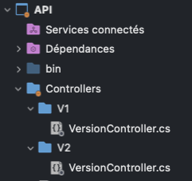

# Versionning des API en ASP.NET Core

Le versioning d'API dans un projet d'application en microservices permet de :

- Garantir la compatibilité entre les versions d'API, afin que les clients puissent continuer à utiliser les API existantes sans être impactés par les changements apportés aux versions plus récentes.
- Permettre le développement simultané de plusieurs versions d'API, sans perturber les utilisateurs des versions existantes.
- Faciliter la maintenance et l'évolution des API, en permettant de déployer de nouvelles versions sans affecter les clients existants.

En résumé, le versioning d'API permet d'améliorer la stabilité, la flexibilité et la maintenabilité des applications en microservices.

## Librairie à installer

```bash
dotnet add Microsoft.AspNetCore.Mvc.Versioning.ApiExplorer
```

> Cette librairie emmène la librairie Microsoft.AspNetCore.Mvc.Versioning

## Implémentation du versioning

#### 1. Ajout du service via l'extension ConfigureServices de votre projet WebAPI :

```c#
public static void AddVersioning(this IServiceCollection services)
    {
        services.AddApiVersioning(opt =>
        {
            opt.DefaultApiVersion = new ApiVersion(1, 0);
            opt.AssumeDefaultVersionWhenUnspecified = true;
            opt.ReportApiVersions = true;
            opt.ApiVersionReader = ApiVersionReader.Combine(new UrlSegmentApiVersionReader(),
                                                            new HeaderApiVersionReader("x-api-version"),
                                                            new MediaTypeApiVersionReader("x-api-version"));
        });

        services.AddVersionedApiExplorer(setup =>
        {
            setup.GroupNameFormat = "'v'VVV";
            setup.SubstituteApiVersionInUrl = true;
        });
    }
```

#### 2. Appel de la méthode précédement créée à ne pas oublier

```c#
services.AddApiVersioning();
```

## Utilisation du versioning

Maintenant que notre configuration est en place, nous devons mettre à jour nos contrôleurs pour accepter les versions de l'API que nous souhaitons offrir aux clients de l'API. Il est possible de configurer un contrôleur entier pour qu'il accepte une version ou de le faire sur une action spécifique dans le contrôleur.

Pour tester la gestion du versioning nous allons créer deux versions d'un controlleur comme suit :



- Créer une Version 1 du controller

```c#

using Microsoft.AspNetCore.Mvc;

// For more information on enabling Web API for empty projects, visit https://go.microsoft.com/fwlink/?LinkID=397860

namespace API.Controllers.V1;

[Route("api/v1/[controller]")]
public class VersionController : Controller
{
    [HttpGet]
    [MapToApiVersion("1.0")]
    public ActionResult Get()
    {
        return Ok(new { message = "Version 1" });
    }
}
```

- Créer Version 2 du controller

```c#

using Microsoft.AspNetCore.Mvc;

// For more information on enabling Web API for empty projects, visit https://go.microsoft.com/fwlink/?LinkID=397860

namespace API.Controllers.V2;

[Route("api/v2/[controller]")]
public class VersionController : Controller
{
    [HttpGet]
    [MapToApiVersion("2.0")]
    public ActionResult Get()
    {
        return Ok(new { message = "Version 2" });
    }
}
```

Maintenant vous pouvez lancer votre API et tester l'appel des différents endpoints pour accéder aux différentes versions de l'api
